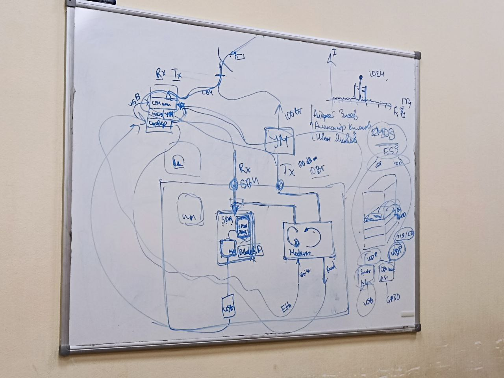

<h3>Постановка целей</h3>

- Осмотреть стойку, сделать её замеры или взять чертёж;
- Сделать 3D модель механического крепления;
- Распечатать крепление на 3D принтере и отфрезеровать на ЧПУ;
- Разводка печатной платы;
- Подумать об использовании микроконтроллера;
- Настроить SDR на анализ спектра и подключить его;
- Сборка, подключение к серверу, запуск.

<h3>Разбираемся с понятиями и назвачением</h3>

- Микроконтроллер

  Нужен для удалённого коммутирования высокочастотного сигнала.
- SDR (Software Defined Radio)
 
  Это радиочастотные приемопередатчики, которые выполняют большинство функций радиосвязи и всю обработку сигналов в области программного обеспечения. Это достигается за счет использования встроенных цифровых компонентов, которые управляются программным обеспечением, в отличие от традиционного радиочастотного оборудования, которое определяется аппаратно и, следовательно, не может быть изменено без физической замены.
- Виды сигналов
Tx - transfer - передача данныx; Rx - receive - получение данных.

- Ethernet (Eth)

  Семейство технологий пакетной передачи данных между устройствами для компьютерных и промышленных сетей.

- ПЛИС (Программируемая логическая интегральная схема)

  Электронный компонент (интегральная микросхема), используемый для создания конфигурируемых цифровых электронных схем. В отличие от обычных цифровых микросхем, логика работы ПЛИС не определяется при изготовлении, а задаётся посредством программирования (проектирования).

<h3>Приложения</h3>

